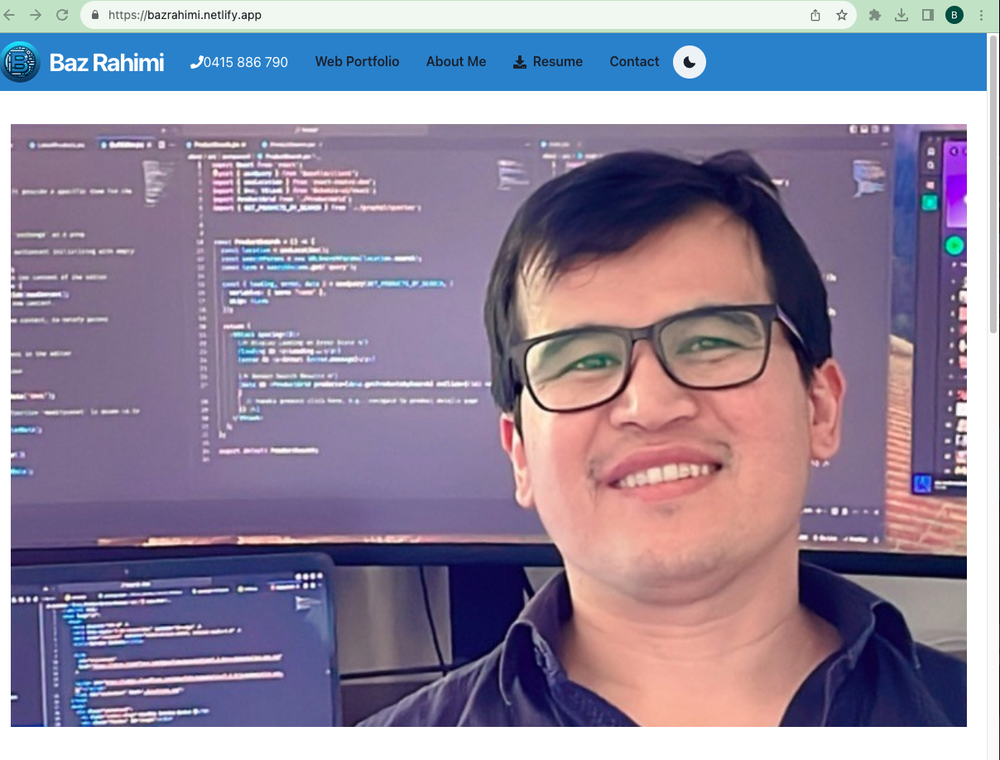

# Baz Rahimi Portfolio


## Table of Contents

- [Description](#description)
- [Installation](#installation)
- [Usage](#usage)
- [Demo](#demo)
- [Technologies Used](#technologies-used)
- [License](#license)
- [Contributing](#contributing)
- [Questions](#questions)

## Description

Welcome to the Baz Rahimi Portfolio, a comprehensive showcase of my skills, projects, and professional journey in the world of web development. This portfolio is designed to provide a deep insight into my expertise and future ambitions.

Key Features:

- **Web Portfolio:** A detailed listing of my projects and accomplishments.
- **About Me:** Insights into my development skills and professional background.
- **Resume:** Access to my downloadable resume.
- **Dark Mode Toggle:** Users can switch to a dark mode for a different visual experience.
- **Responsive Design:** Fully responsive across all device types for an optimal viewing experience.

## Installation

To install the portfolio, follow these steps:

1. Clone the repository:
   ```
   git clone https://github.com/Bazrahimi/BazRahimiPortfolio.git
   ```
2. Navigate to the directory and install dependencies.
3. Run the application using the command:
   ```
   npm run dev
   ```

## Demo

Explore the interface and user experience of my web portfolio through the screenshot provided below. It's deployed on Netlify, offering a glimpse into the modern and intuitive design.



For a live demonstration, visit the [Baz Rahimi Web Portfolio](https://bazrahimi.netlify.app/).

## Technologies Used

The portfolio is built using several modern technologies and tools:

- **React with Vite:** Ensuring a fast and efficient development experience.
- **Node.js:** A JavaScript runtime built on Chrome's V8 JavaScript engine.
- **Chakra UI:** A simple, modular, and accessible component library for React applications.

## License

This project is licensed under the MIT License. The MIT license grants extensive permissions, with the only significant requirement being the preservation of copyright and license notices. For more details, see the [MIT License documentation](https://opensource.org/licenses/MIT).

## Contributing

Contributions to this project are welcome! To contribute:

1. Fork the repository and create your branch from the main branch.
2. Make changes, following the project's code style and conventions.
3. Test your changes thoroughly.
4. Submit a pull request with a detailed description of your changes.

Thank you for your interest in contributing to the Baz Rahimi Portfolio!

## Questions

For any inquiries or feedback, feel free to reach out:

- **Email:** [bazrahimi@hotmail.com](mailto:bazrahimi@hotmail.com)
- **GitHub:** [bazrahimi](https://github.com/bazrahimi)
